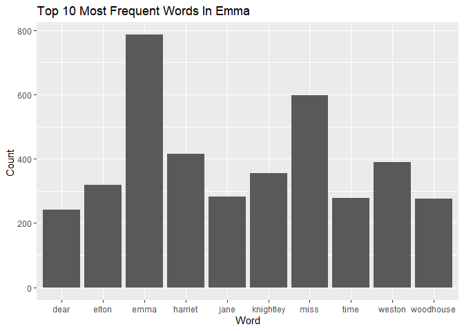

Exercise
================
2023-12-02

\#Exercise 1:

``` r
df <- tibble(txt = emma)
df <- df %>% 
  unnest_tokens(word, txt) %>%
  filter(!word %in% stop_words$word) %>%
  count(word, sort = TRUE)
df
```

    ## # A tibble: 6,829 × 2
    ##    word          n
    ##    <chr>     <int>
    ##  1 emma        786
    ##  2 miss        599
    ##  3 harriet     415
    ##  4 weston      389
    ##  5 knightley   356
    ##  6 elton       319
    ##  7 jane        282
    ##  8 time        279
    ##  9 woodhouse   277
    ## 10 dear        241
    ## # ℹ 6,819 more rows

``` r
plot_df <- head(df,10)
ggplot(plot_df, aes(word, n)) + geom_col() + labs(x = "Word", y = "Count ", title = "Top 10 Most Frequent Words In Emma")
```

<!-- -->
